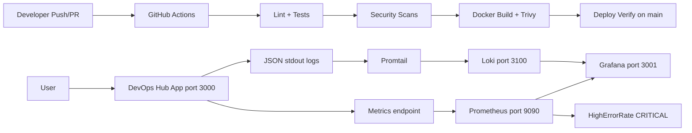
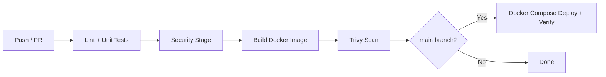

# DevOps Final Project

This repository contains a full-stack DevOps capstone that combines work from three semester assignments into one locally runnable system. The application runs in Docker Compose with Prometheus, Grafana, Loki, and Promtail for metrics, logging, and alerting. CI/CD is handled through GitHub Actions with automated security scanning and deployment verification.

**Repository:** https://github.com/kargimariam/devops_final

## Requirement Mapping

| Requirement | Where it is implemented |
|---|---|
| One-command environment setup | `scripts/setup.ps1`, `scripts/setup.sh` |
| Docker Compose infrastructure | `docker-compose.yml` |
| CI pipeline (lint + tests) | `.github/workflows/ci-cd.yml` — `quality-gate` job |
| CD / deployment verification | `deploy-verify` job, `scripts/deploy.sh`, `scripts/verify-deployment.sh` |
| Security scanning | npm audit, Gitleaks, Hadolint, Trivy in CI |
| Monitoring | Prometheus + Grafana (`prometheus/`, `grafana/`) |
| Structured logging | JSON logs in `server.ts`, Loki + Promtail |
| Alerting | `prometheus/alert_rules.yml` — `HighErrorRate` (CRITICAL) |
| Health checks | `/api/health`, Docker healthcheck, `scripts/monitor.sh` |
| Rollback | `scripts/rollback.sh` |
| Incident response | `docs/INCIDENT_RESPONSE.md` |
| Branching strategy | `main` and `dev` branches |
| Application API + tests | `server.ts`, `src/App.test.tsx` |

## Semester Work Integrated

| Previous assignment | What was kept and improved |
|---|---|
| Assignment 1 (CI/CD) | GitHub Actions pipeline with quality gate, security stage, and deploy verification |
| Assignment 2 (Observability Lab) | Prometheus, Grafana, Loki, Promtail, custom metrics, JSON logs, CRITICAL alerts |
| Midterm (IaC + Blue-Green) | One-command setup, blue-green deploy scripts, rollback, health monitoring |

## Architecture



The React frontend and Express backend expose `/metrics` with `app_requests_total` and `app_errors_total` counters. Prometheus scrapes the application every 15 seconds. Grafana visualizes metrics and logs. Each HTTP request is written to stdout as a JSON log line; Promtail collects container logs and forwards them to Loki. The `HighErrorRate` alert fires when the error rate exceeds 5 errors per minute.

## Tech Stack

- **Application:** React + TypeScript + Express
- **Testing:** Vitest + React Testing Library
- **Containers:** Docker + Docker Compose
- **CI/CD:** GitHub Actions
- **Security:** npm audit, Gitleaks, Hadolint, Trivy
- **Metrics:** Prometheus + prom-client
- **Logging:** JSON logs + Loki + Promtail
- **Visualization and alerting:** Grafana

## Quick Start

### Windows (PowerShell)

```powershell
.\scripts\setup.ps1
```

### Linux / macOS / Git Bash

```bash
bash scripts/setup.sh
```

The setup script creates `.env` if missing, builds and starts the full stack, waits for the health check, and prints service URLs.

### Service URLs

| Service | URL |
|---|---|
| Application | http://localhost:3000 |
| Metrics | http://localhost:3000/metrics |
| Health | http://localhost:3000/api/health |
| Prometheus | http://localhost:9090 |
| Grafana | http://localhost:3001 (admin / admin) |
| Loki | http://localhost:3100 |

### Windows command notes

Development was done on Windows with PowerShell. Shell scripts (`.sh`) are intended for Linux/macOS and run in GitHub Actions on `ubuntu-latest`.

| Task | Windows | Linux / macOS |
|---|---|---|
| Setup | `.\scripts\setup.ps1` | `bash scripts/setup.sh` |
| Start stack | `docker compose up --build -d` | same |
| Stop stack | `docker compose down` | same |
| Lint / tests | `npm run lint` / `npm run test` | same |
| Deploy / rollback | Git Bash required | `bash scripts/deploy.sh` |

`.sh` scripts can also be run on Windows through [Git Bash](https://git-scm.com/download/win).

## Environment Setup (Manual)

```bash
cp .env.example .env
docker compose up --build -d
npm install
npm run lint
npm run test
```

## CI/CD Pipeline

Workflow file: `.github/workflows/ci-cd.yml`



### Pipeline stages

1. **Quality gate** — TypeScript lint and Vitest unit tests
2. **Security** — npm audit, Gitleaks, Hadolint, Docker Compose validation
3. **Build and scan** — Docker image build and Trivy vulnerability scan
4. **Deploy verify (main only)** — starts the stack and runs health and metrics checks

Failed lint, tests, or security checks block the pipeline.

## Deployment

### Docker Compose (primary)

```powershell
.\scripts\setup.ps1
```

Linux / macOS equivalent: `bash scripts/setup.sh`

Docker Compose rebuilds the image, waits for the health check to pass, and routes traffic to the updated container.

### Blue-Green deployment (local)

```bash
bash scripts/deploy.sh
bash scripts/rollback.sh
```

`deploy.sh` runs lint, tests, a production build, and health checks before switching traffic. `rollback.sh` restores the previous version.

### Post-deployment verification

```bash
bash scripts/verify-deployment.sh
```

This script is also executed in the `deploy-verify` CI job on `main`.

## Security

| Control | Tool | Location |
|---|---|---|
| Dependency vulnerabilities | npm audit | CI security job |
| Secrets in repository | Gitleaks | CI security job |
| Dockerfile best practices | Hadolint | CI security job |
| Compose validation | `docker compose config` | CI security job |
| Container image scanning | Trivy | CI build-and-scan job |
| Secrets management | `.env.example`, `.gitignore` | Environment variables are not committed |

## Monitoring, Logging, and Alerting

### Metrics

Custom Prometheus counters at `/metrics`:

- `app_requests_total{endpoint="..."}`
- `app_errors_total`

### Logging

Request logs are written as JSON to stdout. Promtail ships them to Loki. Example Grafana Explore query:

```logql
{job="devops-app"} | json | level="error"
```

### Alerting

`HighErrorRate` in `prometheus/alert_rules.yml` fires at CRITICAL severity when the error rate exceeds 5 per minute.

To trigger the alert for testing:

```powershell
1..20 | ForEach-Object { Invoke-WebRequest "http://localhost:3000/api/simulate-error" -UseBasicParsing }
```

Linux / macOS / Git Bash:

```bash
for i in $(seq 1 20); do curl http://localhost:3000/api/simulate-error; done
```

Check results at http://localhost:9090/alerts and http://localhost:3001/alerting/list.

## Reliability

- Docker health check on the application container
- Health verification in `deploy.sh` before traffic switch
- Automated checks in CI (`deploy-verify`) and `scripts/verify-deployment.sh`
- Rollback via `scripts/rollback.sh`
- Incident response guide in `docs/INCIDENT_RESPONSE.md`
- Health polling every 30 seconds in `scripts/monitor.sh` (logs to `health-check.log`)

```bash
bash scripts/monitor.sh
```

## Branching Strategy

- `main` — stable branch; full CI/CD including deploy verification
- `dev` — integration branch; CI and security without deploy verification

## Application Features

- `GET /api/projects/:id` — dynamic route
- `POST /api/projects` — create project from form input
- `GET /api/health` — health endpoint
- `GET /api/simulate-error` — error simulation for alert testing
- Unit tests in `src/App.test.tsx`

## Screenshots

Evidence for setup, observability, alerting, and CI is included in the `screenshots/` folder.

### Running application


### Health endpoint


### Grafana dashboard


### Loki log analysis


### CRITICAL alert


### Environment setup


### CI/CD pipeline


## Stop the Environment

```bash
docker compose down
```

Remove volumes:

```bash
docker compose down -v
```

## Project Structure

```text
devops_final/
├── .github/workflows/ci-cd.yml
├── docker-compose.yml
├── Dockerfile
├── server.ts
├── scripts/
│   ├── setup.sh / setup.ps1
│   ├── deploy.sh
│   ├── rollback.sh
│   ├── monitor.sh
│   └── verify-deployment.sh
├── prometheus/
├── promtail/
├── grafana/
├── docs/INCIDENT_RESPONSE.md
├── src/
└── README.md
```
