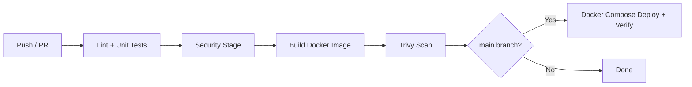

# DevOps Final Project

Unified DevOps capstone that merges and improves three semester assignments into one production-ready, locally runnable system.

## Repository

**GitHub:** https://github.com/kargimariam/devops_final

## Local Application

After running `.\scripts\setup.ps1`, open http://localhost:3000

## What This Project Combines

| Previous assignment | What was kept and improved |
|---|---|
| Assignment 1 (CI/CD + Render) | GitHub Actions pipeline with CI quality gate and automated deployment verification |
| Assignment 2 (Observability Lab) | Prometheus, Grafana, Loki, Promtail, metrics, JSON logs, CRITICAL alerts |
| Midterm (IaC + Blue-Green) | One-command setup, blue-green deploy scripts, rollback, health monitoring |

## Architecture

```mermaid
flowchart LR
    Dev[Developer Push/PR] --> GHA[GitHub Actions]
    GHA --> CI[Lint + Tests]
    CI --> SEC[Security Scans]
    SEC --> BUILD[Docker Build + Trivy]
    BUILD --> DEPLOY[Deploy Verify on main]

    User[User] --> App[DevOps Hub App :3000]
    App --> Metrics[/metrics]
    App --> Logs[JSON stdout logs]

    Metrics --> Prom[Prometheus :9090]
    Logs --> Promtail[Promtail]
    Promtail --> Loki[Loki :3100]
    Prom --> Grafana[Grafana :3001]
    Loki --> Grafana
    Prom --> Alert[HighErrorRate CRITICAL]
```

## Tech Stack

- **Application:** React + TypeScript + Express
- **Testing:** Vitest + React Testing Library
- **Containers:** Docker + Docker Compose
- **CI/CD:** GitHub Actions
- **Security:** npm audit, Gitleaks, Hadolint, Trivy
- **Metrics:** Prometheus + prom-client
- **Logging:** JSON logs + Loki + Promtail
- **Visualization & alerting:** Grafana

## Quick Start (One Command)

### Windows (PowerShell)

```powershell
.\scripts\setup.ps1
```

### Linux / macOS / Git Bash

```bash
bash scripts/setup.sh
```

This single command:

1. Creates `.env` if missing
2. Builds and starts the app + observability stack
3. Waits until the health check passes
4. Prints all service URLs

### Service URLs

| Service | URL |
|---|---|
| Application | http://localhost:3000 |
| Metrics | http://localhost:3000/metrics |
| Health | http://localhost:3000/api/health |
| Prometheus | http://localhost:9090 |
| Grafana | http://localhost:3001 (admin / admin) |
| Loki | http://localhost:3100 |

## Environment Setup (Manual Alternative)

```bash
cp .env.example .env
docker compose up --build -d
npm install
npm run lint
npm run test
```

## CI/CD Pipeline

Workflow file: `.github/workflows/ci-cd.yml`



### Pipeline stages

1. **Quality gate** – TypeScript lint + Vitest unit tests
2. **Security** – npm audit, Gitleaks secrets scan, Hadolint Dockerfile lint, Docker Compose validation
3. **Build & scan** – Docker image build + Trivy vulnerability scan
4. **Deploy verify (main only)** – starts stack, runs health + metrics verification

Broken code or critical security findings block the pipeline.

## Deployment Workflow

### Docker deployment (primary – used for evaluation)

```bash
bash scripts/setup.sh
```

Uses a **rolling update** via Docker Compose: new image is built, health check must pass, then traffic goes to the new container.

### Blue-Green deployment (local simulation)

```bash
bash scripts/deploy.sh
bash scripts/rollback.sh
```

`deploy.sh` now runs real health checks before switching traffic (improved from midterm).

### Post-deployment verification

```bash
bash scripts/verify-deployment.sh
```

## Security Implementation

| Control | Tool | Where |
|---|---|---|
| Dependency vulnerabilities | `npm audit` | CI security job |
| Secrets in repository | Gitleaks | CI security job |
| Dockerfile best practices | Hadolint | CI security job |
| Compose validation | `docker compose config` | CI security job |
| Container image scanning | Trivy | CI build-and-scan job |
| Secrets management | `.env.example` + `.gitignore` | Local env vars, never committed |

## Monitoring, Logging, and Alerting

### Metrics

Custom Prometheus counters exposed at `/metrics`:

- `app_requests_total{endpoint="..."}`
- `app_errors_total`

### Logging

Every request is logged as JSON to stdout. Promtail ships logs to Loki. Query in Grafana Explore:

```logql
{job="devops-app"} | json | level="error"
```

### Alerting

Prometheus rule `HighErrorRate` fires CRITICAL when error rate exceeds 5/minute.

Trigger the alert manually:

```bash
for i in $(seq 1 20); do curl http://localhost:3000/api/simulate-error; done
```

Then check:

- http://localhost:9090/alerts
- http://localhost:3001/alerting/list

## Reliability Improvements

- Docker health checks on the application container
- Real health verification in `deploy.sh` (no fake sleep)
- Automated post-deployment checks in CI and `verify-deployment.sh`
- Rollback script restores previous blue-green version
- Incident response documentation: `docs/INCIDENT_RESPONSE.md`
- SLO: 99% availability target, 30-second health polling via `scripts/monitor.sh`

### Health monitoring

```bash
bash scripts/monitor.sh
```

Results are appended to `health-check.log`.

## Branching Strategy

- `main` – stable, deployable branch (triggers full CI/CD including deploy verify)
- `dev` – integration branch (runs CI + security, no deploy verify)

## Application Features

- Dynamic route: `GET /api/projects/:id`
- Input form: `POST /api/projects`
- Health endpoint: `GET /api/health`
- Error simulation: `GET /api/simulate-error`
- Unit tests: `src/App.test.tsx`

## Screenshots

### Running application


### Health endpoint


### Grafana dashboard (metrics + logs)


### Loki log analysis (JSON logs)


### CRITICAL alert firing


### One-command environment setup


### CI pipeline (add after GitHub push)


## Final Project Requirement Checklist

| Requirement | Implementation | How to verify |
|---|---|---|
| One-command setup | `scripts/setup.ps1` | Screenshot `07_setup_script.png` |
| Docker Compose | `docker-compose.yml` | `docker compose ps` |
| CI (lint + tests) | `.github/workflows/ci-cd.yml` | GitHub Actions on push/PR |
| CD (local deploy) | `deploy-verify` job + `deploy.sh` | Push to `main`, check Actions |
| Security scanning | npm audit, Gitleaks, Hadolint, Trivy | Security job in GitHub Actions |
| Monitoring | Prometheus + Grafana | Screenshot `03_grafana_dashboard.png` |
| Logging | JSON logs + Loki + Promtail | Screenshots `04` and `05` |
| Alerting | `prometheus/alert_rules.yml` | Screenshot `06_alert_firing.png` |
| Health checks | `/api/health`, `monitor.sh` | Screenshot `02_health_endpoint.png` |
| Rollback | `scripts/rollback.sh` | Documented in Deployment Workflow |
| Incident response | `docs/INCIDENT_RESPONSE.md` | Read in repository |
| Branching | `main` + `dev` | Both branches on GitHub |

## Stop the Environment

```bash
docker compose down
```

Remove volumes too:

```bash
docker compose down -v
```

## Project Structure

```text
devops_final/
├── .github/workflows/ci-cd.yml
├── docker-compose.yml
├── Dockerfile
├── server.ts
├── scripts/
│   ├── setup.sh / setup.ps1
│   ├── deploy.sh
│   ├── rollback.sh
│   ├── monitor.sh
│   └── verify-deployment.sh
├── prometheus/
├── promtail/
├── grafana/
├── docs/INCIDENT_RESPONSE.md
├── src/
└── README.md
```

## How to Submit

1. Push this folder to a GitHub repository
2. Ensure GitHub Actions passes on `main`
3. Submit the repository link + this README

All functionality runs locally with Docker — no paid cloud services required for evaluation.
